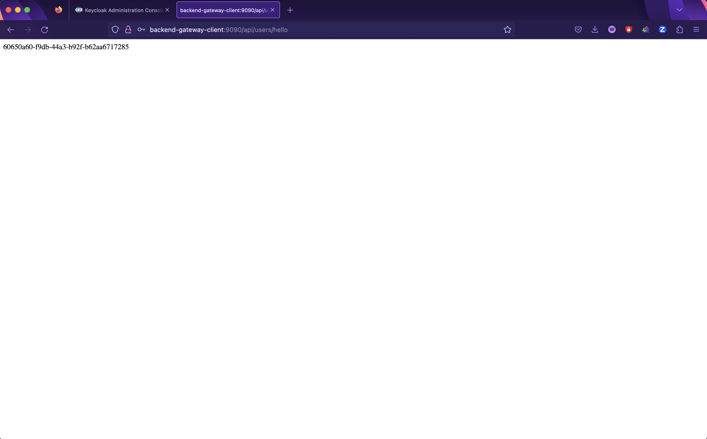
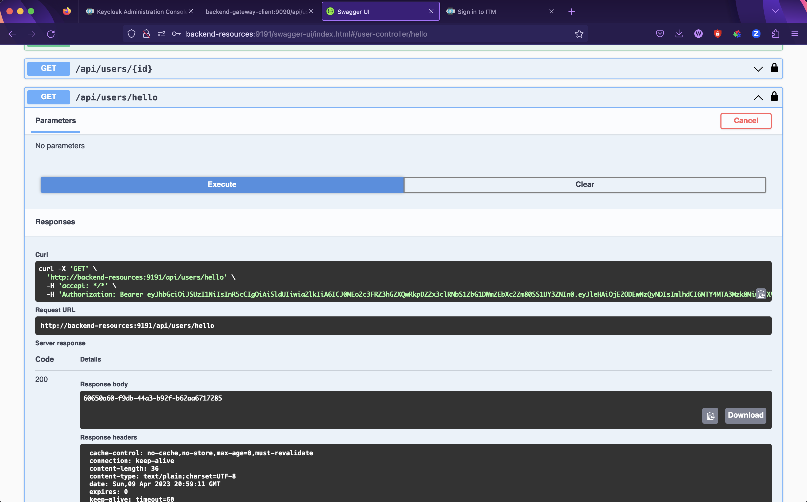

<<<<<<< HEAD
# Микросервисы с Keycloak и Spring Security

Задание базировано и дополнено на основе видео: https://www.youtube.com/watch?v=YHWfJHKGYGI

Видео на английском, поэтому для просмотра необязательно, но рекомендуемо (используйте автоперевод в Яндекс Браузере)

**Примечание:** соблюдайте регистр для всех параметров и аргументов (назания реалма, клиентов и т.д.).

## Основные понятия
    Docker и docker-compose - контейнеризация приложений
    Keycloak - Изучить возможности авторизации и аутентификации, управления пользователями, ролями, группами, клиентами
    Spring Cloud Gateway - Почитать про интеграцию с Keycloak
    Spring Security - Интеграция с Keycloak + ограничение фунционала через роли
    Spring Validation - Валидация данных в контроллерах
    Lombok - Облегченная работа с Getter, Setter, Constructor
    Mapstruct - Маппинг объектов
    Swagger Ui (OpenApi) - Спецификация REST API
### Запуск на локальном хосте

Чтобы запустить проект на локальном окружении, убедитесь, что вы выполнили следующие шаги.

### Backend alias

Следующие строки должны быть добавлены в файл ```/etc/hosts``` на вашей машине, чтобы предотвратить создание браузером 
куки для одного и того же URL, заменяя значения различных бэкэндов.
```
127.0.0.1       backend-keycloak-auth
127.0.0.1       backend-gateway-client
127.0.0.1       backend-resources
```

### Локальное окружение
Первым делом нужно скачать и установить на свой компьютер docker-compose. https://github.com/docker/compose
Для работы проекта необходим запущенный Keycloak и PostgresDB. Запускать мы их будем с помощью docker-compose.
Для этого запустите docker-compose файл в директории backend-keycloak-auth.

### Настройка Keycloak
1) Перейдите на адрес http://backend-keycloak-auth:8080/auth
2) Кликните по **Administration Console**. Логин/пароль: **admin/admin**
3) Создайте новый _Realm_ в Кейклоке. Название: **ITM**
4) Создайте нового клиента. Client ID: **backend-gateway-client**
5) На следующей странице выставьте параметры как на скриншоте: 
6) В созданном клиенте (backend-gateway-client) на главной странице выставьте параметры как на скриншоте:  **ВАЖНО!** обратите свое внимение на настройку CORS политики этого скрина. Оно должно содержать, либо адрес вашего локального хоста и порт с которого заходит ваш браузер, либо звезду, если политика отключена и дано разрешение на подключение с любых хостов. Подробнее о том, что такое CORS можете прочитать в интернет.
7) Создайте нового клиента. Client ID: **backend-resources**. Используйте параметры из пункта 5.
8) На вкладке _Service Accounts Roles_ созданного клиента (backend-resources) нажмите _Assign Role_ и в верхнем левом углу поменяйте фильтр на **Filter by clients** 
9) Выберите и примените к сервисному аккаунту роль _**manage users**_
10) Создайте новую Realm Role. Название: **MODERATOR**
11) Создайте новую группу. Название: **Moderators**. При создании группы добавьте роль, которую вы создали в пункте 10.
12) Создайте нового пользователя на вкладке _Users_. Можно указать только _Username_. Внизу страницы нажмите на _Join Groups_
и добавьте пользователю группу Moderators.
13) На вкладке _Credentials_ пользователя нажмите на установку пароля. Не забудьте снять галочку с _Temporary_,
как это показано на скриншоте. 
14) Скопируйте секретные ключи двух клиентов, которых вы создали ранее. Для этого на странице клиента перейдите на 
вкладку **Credentials** и скопируйте _Client secret_ 
15) Вставьте скопированные ключи в соответствующие _application.yml_ каждого из двух проектов
16) Запустите оба проекта
17) Перейдите на http://backend-gateway-client:9090/api/users/hello Перед вами должно появиться окно аутенфикации Кейклока.
18) Введите логин и пароль пользователя, которого вы создали в пунктах 12, 13.
19) Если вы все сделали правильно, то перед вами должна появиться страница с UUID созданного пользователя 

### Использование Swagger-ui (OpenApi)
1) C запущенными проектами и Кейклоком перейдите на http://backend-resources:9191/swagger-ui/index.html
2) **ЕСЛИ ВЫ ДО ЭТОГО ЛОГИНИЛИСЬ ЧЕРЕЗ БРАУЗЕР (ПУНКТ 18), ТО НУЖНО ОЧИСТИТЬ СЕССИЮ ПОЛЬЗОВАТЕЛЯ В КЕЙКЛОКЕ: ВКЛАДКА SESSIONS В АДМИНКЕ -> SIGN OUT ПОСЛЕ НАЖАТИЯ 3 ТОЧЕК СПРАВА ОТ СЕССИИ**
3) Проведите аутенфикацию через Сваггер. Client Secret нужно вставить от **backend-gateway-client** 
4) Обратитесь на API _hello_ через сваггер: **Try it out -> Execute**. 

=======
# MS
>>>>>>> github/task4.1
